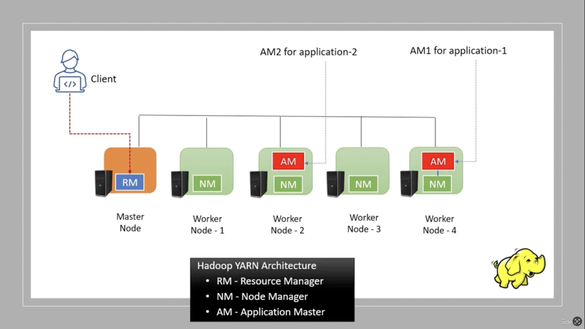
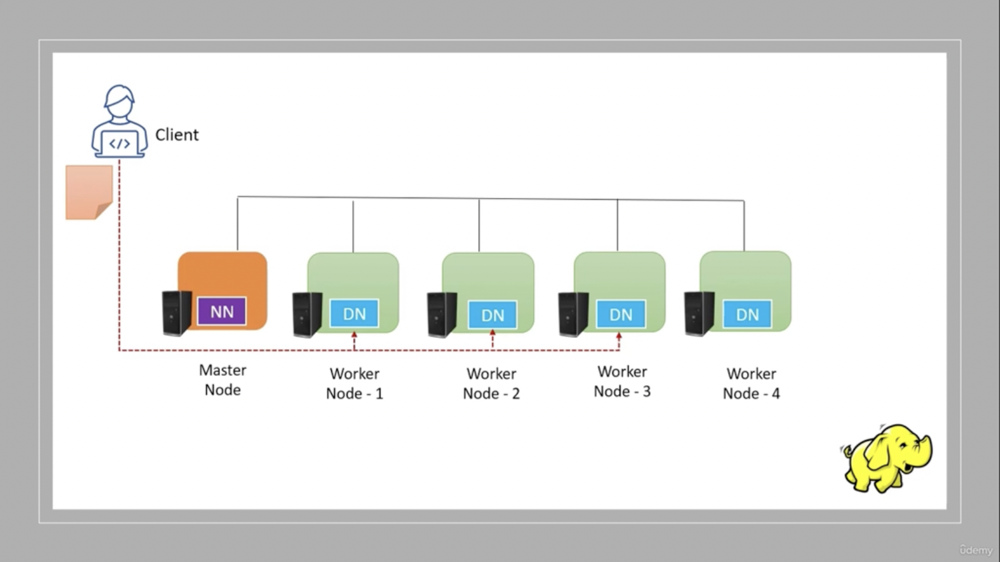
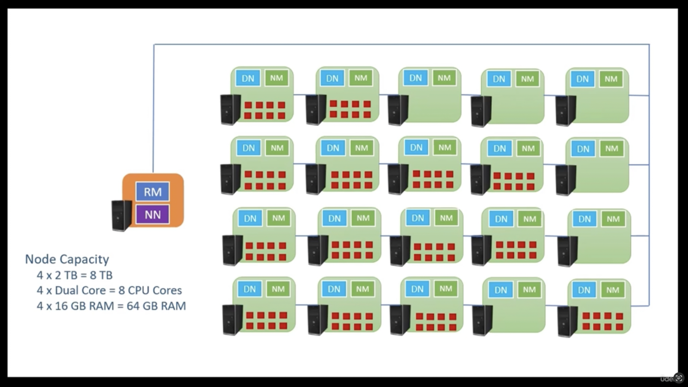
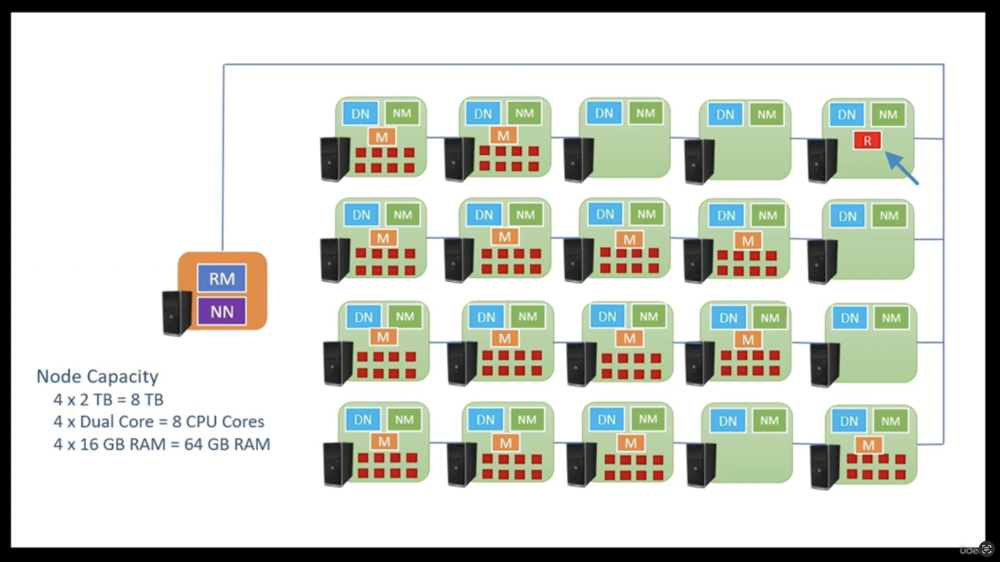
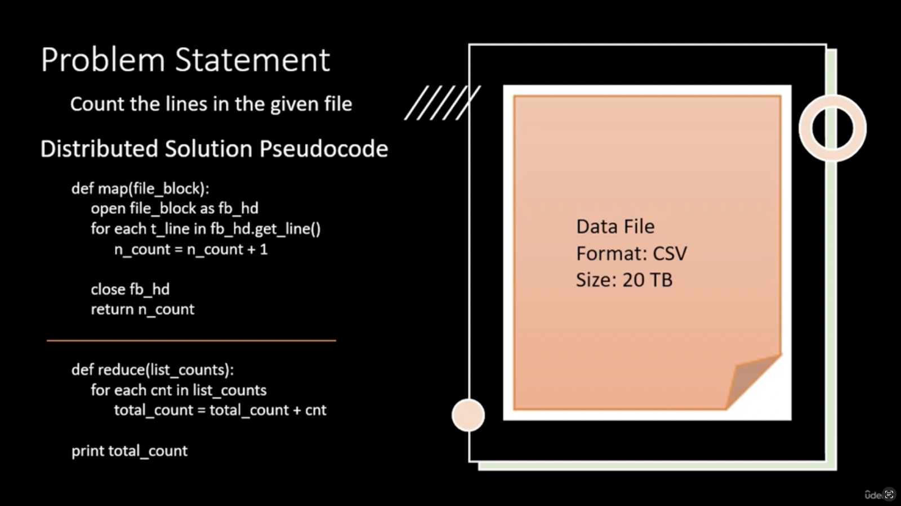

public:: true

- The [[Big Data]] Problem (the 3 V's of Big Data)
    - Variety (structured, semi-structured, unstructured)
    - Volume
    - Velocity
- [[RDBMS]] was not designed to handle high volumes of data arriving at high velocity and variety of data types
- Monolithic approach vs Distributed Approach to handling data volumes
    - Monolithic
        - Eg. Teradata, Exadata
        - Massive [[CPU]] , [[RAM]], [[Disk]]
    - Distributed Approach
        - Cluster of Computers works as a single system
        - [[Scalability]] , [[Fault Tolerance]] , [[High Availability]]
    - |Criteria|Monolithic Approach|Distributed Approach|
      |--|--|--|
      | [[Scalability]] |Vertical, Vendor Co-ordination required, takes time|Simple, Add a new node in the network, Self-Serve|
      |[[Fault Tolerance]] and [[High Availability]]|May not tolerate Hardware failure|Capacity reduced but keeps working|
      |Cost Effectiveness|Expensive at set-up|Economical at set-up, start small, scale up as need grows|
- These needs paved way for development of [[Hadoop]]
- [[Hadoop]]
    - Data processing platform to solve [[Big Data]] problems
    - Shielded developers from complexities of [[Distributed Systems]]
    - Was designed in layers
        - Core Platform layer composed of 3 layers:
            - YARN - Cluster Resource Manager (also called Cluster Operating System)
                - Most critical, because:
                    - Simplification/Abstraction over of a cluster's collective resources ([[CPU]], [[RAM]], storage)
                - 
                    - Each Application on YARN runs inside a different Application Master Container
            - HDFS - Distributed Storage
                - 
                - Has Two main components:
                    - NN - [[Name]] Node
                        - Run on Master Node
                    - DN - Data Node
                        - Run on Worker Node
                - File submitted to HDFS may be broken down into blocks (typical size 128 MB) and spread across nodes
                    - File Metadata is stored at Name Node, metadata includes:
                        - File Name,
                        - Directory Location
                        - File Size
                        - File Blocks, Block IDs, Block sequence, Block Location
            - Map/Reduce - Distributed Computing
                - Map Reduce Programming Model
                    - The instructor introduces a problem of counting the number of lines in a 20 TB csv file
                        - This may lead to hours upon hours (given you can even find a machine with that big [[RAM]] in first place)
                        - Key Challenges:
                            - Storage Capacity
                                - Hadoop handles that using Distributed storage of file
                                  collapsed:: true
                                    - 
                            - Processing Time
                                - Map Reduce handles that by parallel execution of Map commands on all the Worker Nodes holding File Blocks, and Reduce Job aggregates the results of all the Map Jobs
                                  collapsed:: true
                                    - 
                                    -
                        - Pseudocode:
                          collapsed:: true
                            - 
                    - Generally, we don't directly interact with map-reduce model, we go through SQL based intermediaries like Hive SQL, Spark SQL
                    - Summary:
                        - Map function:
                            - Read Data block
                            - Applies Logic at block level,
                            - Map outputs are sent to reduce
                        - Reduce Function:
                            - Receives Map outputs,
                            - Consolidates the Results
                    - Hadoop Map Reduce Framework implements this model
                        - YARN manages the resource allocation
                        - HDFS manages the data blocks
                - Papers:
                    - ((6941a9ab-93cd-476c-8808-37c2fa2b1043))
                    - ((699ad9fb-aba6-4458-a79f-69ef793fb674))
    - Challenges with [[Hadoop]]
        - Performance
            - Hive SQL Queries were relatively slower (as they were an abstraction layer over Hadoop's Map Reduce framework)
        - Ease of Development
            - Map Reduce was understood by few (in comparison to SQL)
        - Language Support
            - Map Reduce framework was available only in Java
        - Advent of Cloud Platforms added two further problems:
            - Storage
                - Setting up storage required adding computers to the cluster, but couldn't offer cost saving by utilizing cheap cloud storage options like [[AWS S3]]
            - Resource Management
                - YARN resource manager forced installation and creation of Hadoop cluster for container management, but tools like Docker were gaining popularity
    - Advantages of [[Spark]] over [[Hadoop]]
        - Performance
            - 10-100 times faster than Hadoop Map Reduce
        - Ease of Development
            - Spark SQL
            - High performance SQL engine
            - Composable Function API
        - Language Support
            - Java, Scala, Python, R
        - Storage
            - HDFS Storage
            - Cloud Storage
        - Resource management
            - YARN, Mesos, Kubernetes
    -
    -
    -