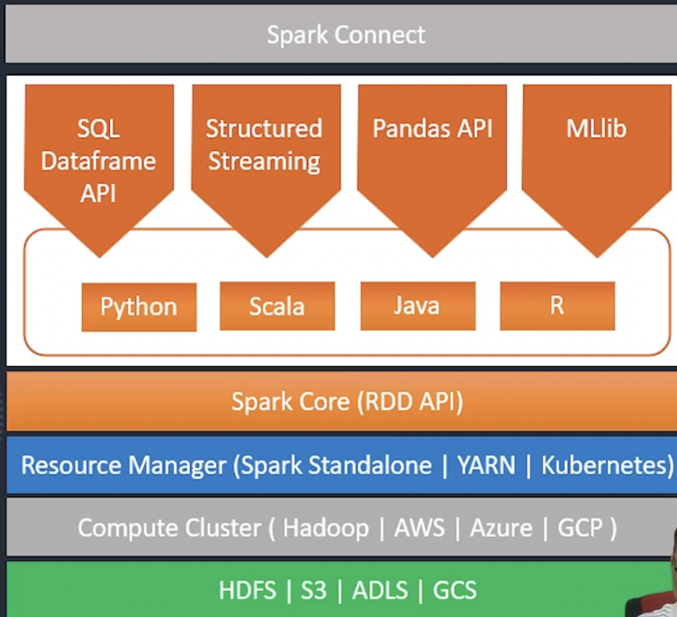

- [[Spark]]
    - Is a Multi-Language engine for executing [[Data Engineering]], [[Data Science]] and [[Machine Learning]] on Single-Node machine or clusters
    - Capabilities:
        - [[ANSI SQL]]
        - [[Batch Processing]] API
        - [[Stream Processing]] API
        - [[Machine Learning]] API
- Why [[Apache Spark]]:
    - Abstraction over task execution (SQL, API's)
    - Ease of Use
    - Unified Platform for a lot of [[DE]] , [[ML]] , Reporting use-cases
    - Open Source
    - Expansive Ecosystem
- Architecture
    - Diagram
      collapsed:: true
        - 
        -
    - Spark Connect
        - To support client server style (eg. code is on client machine but run on server and results are returned) (kinda like PSQL )
    - Spark Core ([[RDD]] API)
        - is the heart of [[Spark]] and is a set of core libraries and API's written in [[Scala]]
        - Over time other wrapper libraries were written to support [[Python]], [[Java]], and [[R]]
        - Wrappers exist in [[Python]], [[Scala]], [[Java]] and [[R]] for these 4 kinds of API sets:
            - [[SQL]] and [[Dataframe]] API's
            - Structured Streaming API's
            - Pandas API
            - MLlib
                - for [[Machine Learning]]
        - Any code written using any API in any language is ultimately compiled to core Spark [[RDD]] API's
    - Resource Management (Spark Standalone | YARN | Kubernetes)
    - Compute (Hadoop | AWS | Azure | GCP)
    - Storage (HDFS | S3 | GCS | ADLS)
- [[DataBricks]]
    - Managed Open Source integration platform
        - [[Apache Spark]]
        - ML Flow
        - [[Delta Lake]]
        - [[Unity Catalog]]
        - [[PostgreSQL]]
    - Available on AWS, Azure, GCP
    - Capabilities
        - Spark On-the-Cloud platform
        - On-demand Cluster
        - [[Delta Lake]] Storage
        - Workflows and [[ETL]]
        - [[Data Warehouse]]
        - [[ML]] and [[AI]] Capabilities
        - Security and Governance
        - Automation Tools
        - Ecosystem and partners
        -