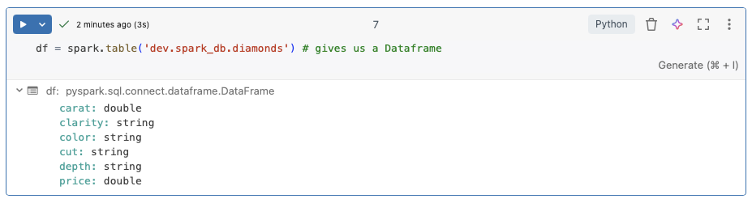
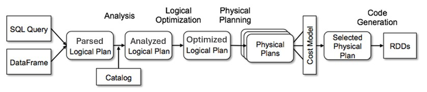

- [[Extract-Load-Transform]]
    - Extract
        - What: Read from Source Systems
        - How: Ingestion Tools (usually) or Spark Source System Connector
    - Load
        - What: Save to [[Data Lake]]
        - How: Ingestion Tools (usually) or Spark Source System Connector
    - Transform
        - What: Process / Prepare data as per business requirement
        - How: Spark Dataframe / Spark SQL
            - Read from [[Data Lake]]: [[Spark Session]]
            - Transform: Dataframe / SQL
            - Save: Dataframe / SQL
- [[Spark Session]]
    - An entry point to programming [[Spark]] with the [[Dataframe]] API
    - A Spark Session can be used for:
        - Connect to Cluster as a Driver
          collapsed:: true
            - has details of cluster
            - driver/worker concept
        - Create [[Dataframe]] (by reading Data Files or Tables)
        - Read Data Files
        - Read Data Tables
        - Execute SQL over Tables
        - Access Runtime Configuration
        - Access to Spark Context
            - Gateway to Spark Core API's ([[RDD]])
    - How to create
        - Spark Session Builder - Server Side
        - Spark Connect Session Builder - Client Server
- [[DataFrame]]
    - Is a Two dimensional labeled data structure, kinda similar to a spreadsheet or [[SQL]] Tables, Spark [[DataFrames]] offer several key advantages: [From Spark Documentation](https://spark.apache.org/docs/latest/api/python/user_guide/dataframes.html) #[[Internet Resource]]
        - **Distributed Computing:** [[Spark]] distributes data across multiple nodes in a cluster, allowing for parallel processing of [[Big Data]]
        - **In-memory processing:** Spark performs computations in memory which can be significantly faster than disk based processing
        - **Schema Flexibility:** Unlike traditional databases, PySpark DataFrames support schema evolution and dynamic typing
        - **Fault Tolerance:** [[DataFrames]] are built on top of [[RDD]] which are inherently [[fault-tolerant]] . [[Spark]] automatically handles node failures and data replication, ensuring data reliability and integrity.
    - Simple DataFrame creation from table:
      collapsed:: true
        - {:height 235, :width 840}
        -
    - Code Examples:
        - [Simple Spark Session and DataFrame creation](..assets/pyspark_course/01-spark-session-practice.ipynb)
        - [DataFrame Simple transformations](..assets/pyspark_course/02-spark-dataframe-practice.ipynb)
    - When an action is called upon a DataFrame, the whole DataFrame transformations are lazily executed after query optimization
        - 
        - ```python
          fire_df = spark.read.table('dev.spark_db.sf_fire_calls')
          df_1 = fire_df.select("CallType", "Zipcode")
          df_2 = df_1.where("CallType is not null")
          df_3 = df_2.groupBy("CallType" "Zipcode").count()
          df_4 = df_3.orderBy("count", ascending=False)
          df_5 = df_4.limit(3)
          
          df_5.show() # this will trigger the query optimization and execution
          ```
        -
    -
    -
-